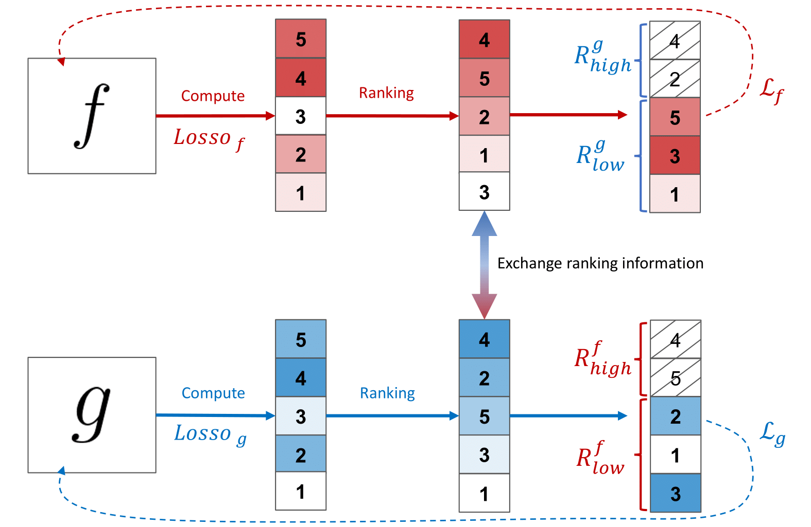

# Multi-Label Noise Robust Collaborative Learning for Remote Sensing Image Classification

This repository contains code of the paper `Multi-Label Noise Robust Collaborative Learning for Remote Sensing Image Classification`. This work has been developed developed at the [Remote Sensing Image Analysis group](https://www.rsim.tu-berlin.de/menue/remote_sensing_image_analysis_group/) by Ahmet Kerem Aksoy, Mahdyar Ravanbakhsh and Begüm Demir.

If you use this code, please cite our paper given below:
> A. K. Aksoy, M. Ravanbakhsh and B. Demir, "Multi-Label Noise Robust Collaborative Learning for Remote Sensing Image Classification," in IEEE Transactions on Neural Networks and Learning Systems, 2022, doi: 10.1109/TNNLS.2022.3209992.



_RCML intuition: For a batch of input images, the models `f` and `g` need to agree on a subset, which contains only the correctly annotated images._

## Description

We propose a multi-label learning method based on the idea of co-training for scene classification of remote sensing (RS) images with noisy labels. It identifies noisy samples and excludes them from back-propagation, aiming to train the classifier solely with clean samples. It also predicts the most noisy label in each sample.

Two Deep Neural Networks are trained with the same architecture simultaneously. The model is enhanced with a discrepancy module to make the two networks learn complementary features of the same data, while ensuring consistent predictions. This is achieved by creating a statistical difference between the logits of the two networks through the maximum mean discrepancy distance, and then converging the outputs of the networks using the same distance. Learning complementary features allows the two networks to correct each other by selecting clean instances with the loss information provided by the opposite network, and only using the clean instances to update their weights. The proposed method can also identify noisy labels in samples using the group lasso method. It can weigh the potential noisy samples down or up according to the noise type that they include.

## Dependencies
The code in this repository has been tested with `Python 3.6.9`. To run it, the following packages must be installed:
- `tensorflow==2.3.0`
- `tensorflow-addons==0.11.2`
- `scikit-learn==0.24.2`


## Datasets
We have tested the method on two different RS datasets: [BigEarthNet](http://bigearth.net/) and [UC Merced Land Use dataset](http://weegee.vision.ucmerced.edu/datasets/landuse.html). This repository supports different versions of these datasets:
- BigEarthNet with a 12 class-nomenclature
- BigEarthNet with a 19 class-nomenclature
- BigEarthNet with a 43 class-nomenclature
- UC Merced Land Use dataset annotated with multi-labels provided [here](https://bigearth.eu/datasets)

To use BigEarthNet, three [TFRecord](https://www.tensorflow.org/tutorials/load_data/tfrecord) are needed: `train.tfrecord`, `val.tfrecord` and `test.tfrecord`. The path to the directory containing the three files must be provided as `dataset_path` in the command line arguments.

The UC Merced Land Use dataset is loaded through [pickle](https://docs.python.org/3/library/pickle.html) files. To use it, 6 pickle files must be created: `namely x_train.pickle`, `x_validation.pickle`, `x_test.pickle`, `y_train.pickle`, `y_validation.pickle`, `y_test.pickle`. The directory with these 6 files must be provided as `dataset_path` in the command line arguments.

## How to run
`pip install -r requirements.txt && cd script/ucmerced && ./run.sh`

## Authors
Ahmet Kerem Aksoy

## License
The code in this repository is licensed under the **MIT License**:

```
MIT License

Copyright (c) 2021 Ahmet Kerem Aksoy

Permission is hereby granted, free of charge, to any person obtaining a copy
of this software and associated documentation files (the "Software"), to deal
in the Software without restriction, including without limitation the rights
to use, copy, modify, merge, publish, distribute, sublicense, and/or sell
copies of the Software, and to permit persons to whom the Software is
furnished to do so, subject to the following conditions:

The above copyright notice and this permission notice shall be included in all
copies or substantial portions of the Software.

THE SOFTWARE IS PROVIDED "AS IS", WITHOUT WARRANTY OF ANY KIND, EXPRESS OR
IMPLIED, INCLUDING BUT NOT LIMITED TO THE WARRANTIES OF MERCHANTABILITY,
FITNESS FOR A PARTICULAR PURPOSE AND NONINFRINGEMENT. IN NO EVENT SHALL THE
AUTHORS OR COPYRIGHT HOLDERS BE LIABLE FOR ANY CLAIM, DAMAGES OR OTHER
LIABILITY, WHETHER IN AN ACTION OF CONTRACT, TORT OR OTHERWISE, ARISING FROM,
OUT OF OR IN CONNECTION WITH THE SOFTWARE OR THE USE OR OTHER DEALINGS IN THE
SOFTWARE.
```
